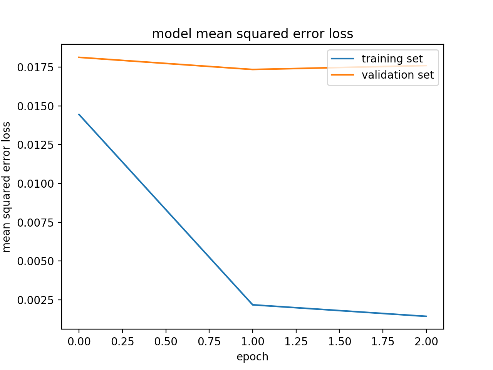

# CarND-Behavioral-Cloning-P3
Udacity Self Driving Car Nanodegree - Behavioral Cloning

# Installation
To create an environment for this project use the following command:

```
conda env create -f environment.yml
```

After the environment is created, it needs to be activated with the command:

```
source activate self_drive (env name)
```

# Project

## Goals

The goals/steps of this project are the following:

- Use the simulator to collect data of good driving behavior.
- Build, a convolution neural network in [Keras](https://keras.io/) that predicts steering angles from images.
- Train and validate the model with a training and validation set.
- Test that the model successfully drives around track one without leaving the road.
- Summarize the results with a written report.

## Rubric points

Here I will consider the [rubric points](https://review.udacity.com/#!/rubrics/432/view) individually and describe how I addressed each point in my implementation.

### Files Submitted & Code Quality

#### 1. Submission includes all required files and can be used to run the simulator in autonomous mode
My project includes the following files:

- **model.py** : Containing the script to create and train the model
- **drive.py** : For driving the car in autonomous mode in the simulator 
- **writeup_report.md** : Summarizing the results
- **run1.mpy** : video sample

Node:

On my first iteration, I tried [LeNet](http://yann.lecun.com/exdb/lenet/) model and [nVidia Autonomous Car Group](https://devblogs.nvidia.com/parallelforall/deep-learning-self-driving-cars/) model

#### 2. Submission includes functional code Using the Udacity provided simulator and my drive.py file; the car can be driven autonomously around the track by executing

```
Python drive.py model.h5
```

#### 3. Submission code is usable and readable

The model.py file contains the code for training and saving the convolution neural network. The file shows the pipeline I used for training and validating the model, and it contains comments to explain how the code works.

### Model Architecture and Training Strategy

#### 1. An appropriate model architecture has been employed

My initial approach was to use [LeNet](http://yann.lecun.com/exdb/lenet/), but it was hard to have the car inside the street with three epochs (this model could be found [here](clone.py#L81-L94)). After this, I decided to try the [nVidia Autonomous Car Group](https://devblogs.nvidia.com/parallelforall/deep-learning-self-driving-cars/) model, and the car drove the complete first track after just three training epochs (this model could be found [here](model.py#L108-L123)).

A model summary is as follows:

```
Layer (type)                                  Connected to                     
====================================================================================================
lambda_1 (Lambda)              |    lambda_input_2[0][0]             
_______________________________|_____________________________________________________________________
cropping2d_1 (Cropping2D)      |    lambda_1[0][0]                   
_______________________________|_____________________________________________________________________
convolution2d_1 (Convolution2D)|    cropping2d_1[0][0]               
_______________________________|_____________________________________________________________________
convolution2d_2 (Convolution2D)|    convolution2d_1[0][0]            
_______________________________|_____________________________________________________________________
Dropout                        |    convolution2d_2[0][0]
_______________________________|______________________________________________________________________
convolution2d_3 (Convolution2D)|    Dropout            
_______________________________|_____________________________________________________________________
convolution2d_4 (Convolution2D)|    convolution2d_3[0][0]            
_______________________________|_____________________________________________________________________
convolution2d_5 (Convolution2D)|    convolution2d_4[0][0]            
_______________________________|_____________________________________________________________________
flatten_1 (Flatten)            |    convolution2d_5[0][0]            
_______________________________|_____________________________________________________________________
dense_1 (Dense)                |    flatten_1[0][0]                  
_______________________________|_____________________________________________________________________
dense_2 (Dense)                |    dense_1[0][0]                    
_______________________________|_____________________________________________________________________
dense_3 (Dense)                |    dense_2[0][0]                    
_______________________________|_____________________________________________________________________
dense_4 (Dense)                |    dense_3[0][0]                    
====================================================================================================
```

(More details about this bellow.)

#### 2. Attempts to reduce overfitting in the model

I decided  to modify the model by applying regularization techniques like [Dropout](https://en.wikipedia.org/wiki/Dropout_(neural_networks)) of .1 only (due to low epoch).thendecided to keep the training epochs low: only three epochs.
In addition to that, I split my sample data into training and validation data
The model used an Adam optimizer, so the learning rate was not tuned manually

#### 4. Appropriate training data

Training data was chosen to keep the vehicle driving on the road. Also, the data provided by Udacity, I used the first track and second track data. The simulator provides three different images: center, left and right cameras. Each image was used to train the model.

For details about how I created the training data, see the next section.

### Model Architecture and Training Strategy

#### 1. Solution Design Approach

##### My first step was to try the LeNet](http://yann.lecun.com/exdb/lenet/) model with three epochs and the training data provided by Udacity. On the first track, the car went straight to the lake. I needed to do some pre-processing. A  `Lambda` layer was introduced to normalize the input images to zero means. This step allows the car to move a bit further, but it didn't get to the first turn. Another `Cropping` was introduced, and the first turn was almost there, but not quite.

##### The second step was to use a more powerfull model: [nVidia Autonomous Car Group](https://devblogs.nvidia.com/parallelforall/deep-learning-self-driving-cars/) The only modification was to add a new

##### layer at the end to have a single output as it was required. This time the car did its first complete track, but there 
#### was a place in the track where it passes over the "dashed" line. More data was needed. Augmented the data by adding the same image flipped with a negative angleIn addition to that, the left and right camera images where introduced with a correction factor on the angle to help the car go back to the lane, After this process, the car continues to have the same problem with the same "dashed" line.

#### 2. Creation of the Training Set & Training Process

To have more data, the following tracks were capture:

- First track.
  - One track driving forward partial driving.
  - One track driving backward partial driving.
- half second track driving 

All these data was used for training the model with three epochs. The data was shuffled randomly. The following picture shows the training:

[Model Mean-square ](model_mse_lost.png)


 
After this training, the car was driving down the road all the time on the [first](run1.mp4) and in some part of second track 


