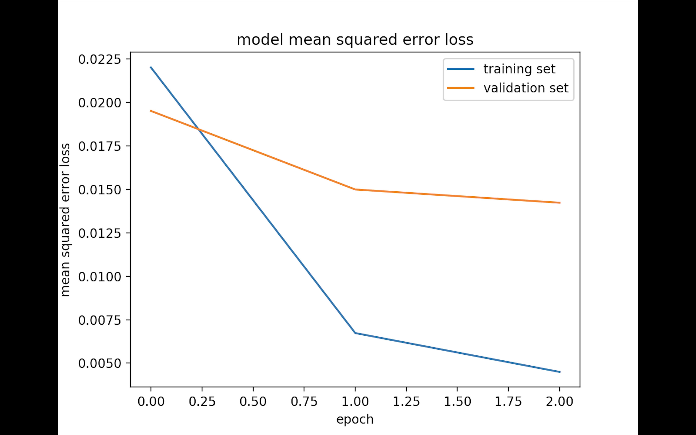

# **Behavioral Cloning** 

##Writeup Template


**Behavioral Cloning Project**

The goals / steps of this project are the following:
* Use the simulator to collect data of good driving behavior
* Build, a convolution neural network in Keras that predicts steering angles from images
* Train and validate the model with a training and validation set
* Test that the model successfully drives around track one without leaving the road
* Summarize the results with a written report
* Create video of the project result 


## Rubric Points
###Here I will consider the [rubric points](https://review.udacity.com/#!/rubrics/432/view) individually and describe how I addressed each point in my implementation.  

---
###Files Submitted & Code Quality

####1. Submission includes all required files and can be used to run the simulator in autonomous mode

My project includes the following files:
* model.py containing the script to create and train the model
* drive.py for driving the car in autonomous mode
* model.h5 containing a trained convolution neural network 
* writeup_report.md or writeup_report.pdf summarizing the results

####2. Submission includes functional code
Using the Udacity provided simulator and my drive.py file, the car can be driven autonomously around the track by executing 
```sh
python drive.py model.h5
```

####3. Submission code is usable and readable

The model.py file contains the code for training and saving the convolution neural network. The file shows the pipeline I used for training and validating the model, and it contains comments to explain how the code works.

###Model Architecture and Training Strategy

####1. An appropriate model architecture has been employed

My model consists of a convolution neural network with 3x3 filter sizes and depths between 32 and 128 (model.py lines 18-24) 

The model includes RELU layers to introduce nonlinearity, and the data is normalized in the model using a Keras lambda layer (code line 18). 

####2. Attempts to reduce overfitting in the model

The model contains dropout layers in order to reduce overfitting 

The model was trained and validated on different data sets to ensure that the model was not overfitting (code line 10-16). The model was tested by running it through the simulator and ensuring that the vehicle could stay on the track.

####3. Model parameter tuning

The model used an adam optimizer, so the learning rate was not tuned manually 

####4. Appropriate training data

Training data was chosen to keep the vehicle driving on the road. I used a combination of center lane driving, recovering from the left and right sides of the road ... 


###Model Architecture and Training Strategy

####1. Solution Design Approach

The overall strategy for deriving a model architecture was to ...

My first step was to use a convolution neural network model similar to the ... I thought this model might be appropriate because ...

In order to gauge how well the model was working, I split my image and steering angle data into a training and validation set. 


The final step was to run the simulator to see how well the car was driving around track one. There were a few spots where the vehicle fell off the track, to improve the driving behavior in these cases, 

At the end of the process, the vehicle is able to drive autonomously around the track without leaving the road.

####2. Final Model Architecture

The final model architecture  consisted of a convolution neural network with the following strucutre define below 
```
Layer (type)                                  Connected to                     
====================================================================================================
lambda_1 (Lambda)              |    lambda_input_2[0][0]             
_______________________________|_____________________________________________________________________
cropping2d_1 (Cropping2D)      |    lambda_1[0][0]                   
_______________________________|_____________________________________________________________________
convolution2d_1 (Convolution2D)|    cropping2d_1[0][0]               
_______________________________|_____________________________________________________________________
convolution2d_2 (Convolution2D)|    convolution2d_1[0][0]            
_______________________________|_____________________________________________________________________
Dropout                        |    convolution2d_2[0][0]
_______________________________|______________________________________________________________________
convolution2d_3 (Convolution2D)|    Dropout of .3            
_______________________________|_____________________________________________________________________
convolution2d_4 (Convolution2D)|    convolution2d_3[0][0]            
_______________________________|_____________________________________________________________________
convolution2d_5 (Convolution2D)|    convolution2d_4[0][0]            
_______________________________|_____________________________________________________________________
flatten_1 (Flatten)            |    convolution2d_5[0][0]            
_______________________________|_____________________________________________________________________
dense_1 (Dense)                |    flatten_1[0][0]                  
_______________________________|_____________________________________________________________________
dense_2 (Dense)                |    dense_1[0][0]                    
_______________________________|_____________________________________________________________________
dense_3 (Dense)                |    dense_2[0][0]                    
_______________________________|_____________________________________________________________________
dense_4 (Dense)                |    dense_3[0][0]                    
====================================================================================================
```


####3. Creation of the Training Set & Training Process

To capture good driving behavior, I first recorded one partial lap basically i try to have the optimizted data because rest all case were similar


I then recorded the vehicle recovering from the left side and right sides of the road back to center so that the vehicle would learn to get back , this was the main thing i looked to give my main focus on as it was covring all the main edge cases 


To augment the data sat, I also flipped images and angles thinking that this would ... For example, here is an image that has then been flipped:


After the collection process, I had X number of data points. I then preprocessed this data by ...


I finally randomly shuffled the data set and put Y% of the data into a validation set. 

I used this training data for training the model. The validation set helped determine if the model was over or under fitting. The ideal number of epochs was Z as evidenced by ... I used an adam optimizer so that manually training the learning rate wasn't necessary.


####4. Final image means square loass difference 

MSE image  before dropout 
MSE image2 after dropoup  


